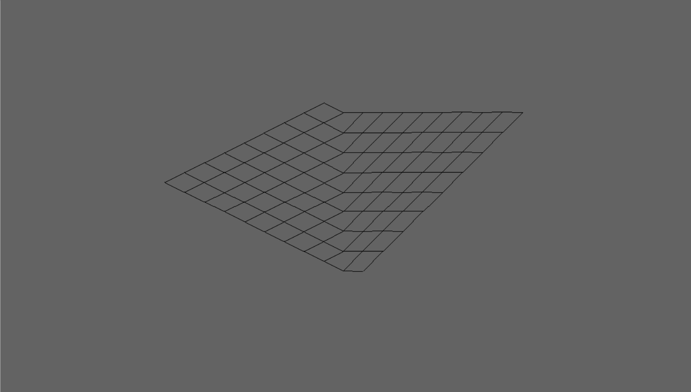
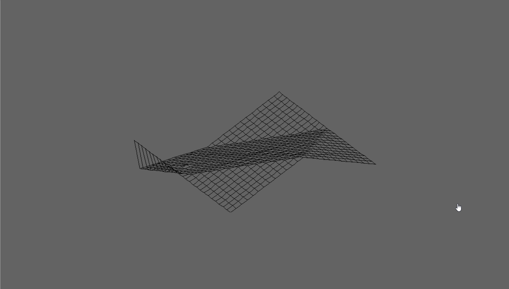
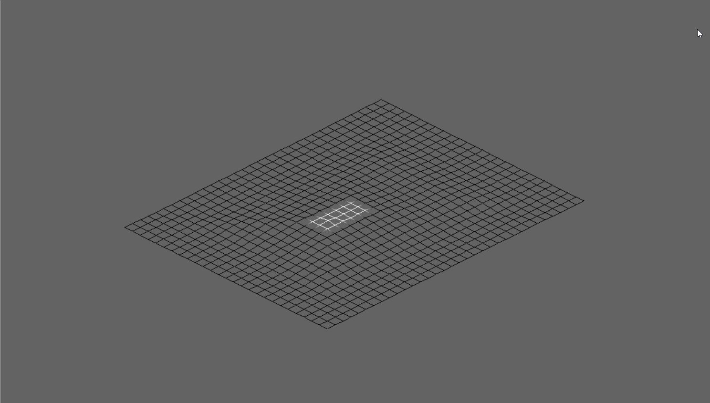
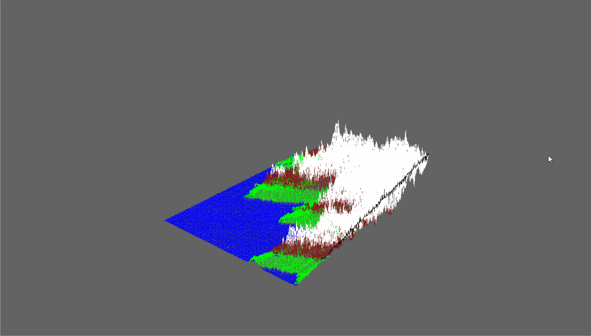
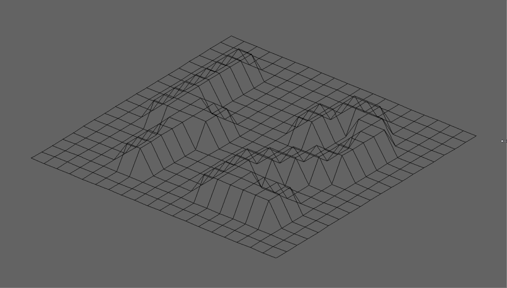

# FdF

## Project description

The representation in 3D of a landscape is a critical aspect of modern mapping.

For example, in these times of spatial exploration, to have a 3D representation of Mars is a prerequisite condition to its conquest.

As another example, comparing various 3D representations of an area of high tectonic activity will allow you to better understand these phenomena and their evolution,
and as a result, be better prepared. It’s your turn today to modelize some 3D magnificent landscapes, imaginary or not.

This project is about creating a simple wireframe model representation of a 3D landscape by linking various points (x, y, z) thanks to line segments (edges).

## Run it yourself!

### Prerequisites

- libx11-dev
- libglfw3-dev
- libglfw3
- xorg-dev
- GNU Make >= 4.2.1
- gcc >= 9.4.0

If you are using Mac, I asume you have homebrew installed. If so, you need to install the **glfw** library through `brew install glfw`.

If you are using Linux, install **glfw** using apt.

### How to compile

Just run `make` in the program folder.

### Using the program

The coordinates of the landscape are stored in a .fdf file passed as a parameter to the program. You can find a bunch of .fdf maps at the `test_maps` folder or create your own.

To run it, just pass a valid fdf map as a parameter to the program. Example:

`./fdf test_maps/42.fdf`

Here is an example of such map:

```
$>cat 42.fdf

0 0 0  0  0  0  0  0  0  0  0  0  0  0  0  0  0  0  0
0 0 0  0  0  0  0  0  0  0  0  0  0  0  0  0  0  0  0
0 0 10 10 0  0  10 10 0  0  0  10 10 10 10 10 0  0  0
0 0 10 10 0  0  10 10 0  0  0  0  0  0  0  10 10 0  0
0 0 10 10 0  0  10 10 0  0  0  0  0  0  0  10 10 0  0
0 0 10 10 10 10 10 10 0  0  0  0  10 10 10 10 0  0  0
0 0 0  10 10 10 10 10 0  0  0  10 10 0  0  0  0  0  0
0 0 0  0  0  0  10 10 0  0  0  10 10 0  0  0  0  0  0
0 0 0  0  0  0  10 10 0  0  0  10 10 10 10 10 10 0  0
0 0 0  0  0  0  0  0  0  0  0  0  0  0  0  0  0  0  0
0 0 0  0  0  0  0  0  0  0  0  0  0  0  0  0  0  0  0

```

### Expected output


## More examples!

### Zoom



### Rotations



### Movements


### Adjust the Z scale



### Change the type of projection



### Bonus: rainbow mode!


